  

# 🤖 Awesome Chatbot Development Platform 🚀

> 💡 **Curated List of SaaS Products & Open-Source GitHub Projects for Building Next-Generation Chatbots, Voice Assistants, and AI Agents.**  
> *Focused on Conversational AI Frameworks, Visual Flow Builders, Multi-Channel Deployment & NLU Engines.*  
> **Last updated: October 2026**

---

## 🔍 Overview & Ecosystem Insights 📊

This repository tracks notable **SaaS platforms** and **open-source projects** for **Chatbot Development**. These tools empower developers, startups, and enterprises to build, test, prototype, and deploy intelligent conversational agents across web, mobile, messaging platforms (Slack, WhatsApp, Telegram, Teams), and voice channels.

- **Market Size & Structure**: The global Conversational AI and Chatbot market is estimated at **$12.3 Billion** and is projected to reach **$49.9 Billion**, growing at a CAGR of **~31%**. The market is **moderately fragmented** — while cloud giants dominate large enterprise infrastructure, specialized SaaS platforms and vibrant open-source frameworks capture significant market share in developer agility, workflow orchestration, and on-premise privacy.

---

## 📑 Table of Contents

- [🏢 SaaS & Cloud-Hosted Platforms](#-saas--cloud-hosted-platforms)
- [🔓 Open-Source GitHub Projects](#-open-source-github-projects)
  - [⚡ Full Frameworks & AI Agent Platforms](#-full-frameworks--ai-agent-platforms)
  - [🔮 Visual Flow Builders & Conversational UI](#-visual-flow-builders--conversational-ui)
  - [🛠️ Developer Toolkits & SDKs](#%EF%B8%8F-developer-toolkits--sdks)
  - [💬 Customer Support & Omnichannel Platforms](#-customer-support--omnichannel-platforms)
- [🤝 How to Contribute](#-how-to-contribute)
- [💖 Support & Sponsorship](#-support--sponsorship)
- [📈 Star History](#-star-history)
- [⚠️ Disclaimer](#%EF%B8%8F-disclaimer)

---

## 🏢 SaaS & Cloud-Hosted Platforms 🌐

Below is a detailed breakdown of the leading commercial Conversational AI and Chatbot development platforms, sorted by **Company Size / Valuation** (descending).

| Platform | Description & Key Features | Company Size / Revenue / Valuation | Starting Tier Price | Free Tier / Trial Limits |
| :--- | :--- | :--- | :--- | :--- |
| **[Microsoft Azure Bot Service](https://azure.microsoft.com/en-us/products/ai-services/ai-bot-service)** | Enterprise bot development platform integrated with Azure. Features Bot Framework SDK, multi-channel connections (Teams, Slack, Web), and Azure AI Speech / Language integration. | **~$3.1 Trillion** (Market Cap) | **$0.50 per 1,000 messages** (S1 Standard Premium Channels) | **10,000 free messages/month** (Standard channels like Web Chat & Direct Line are free forever) |
| **[Google Dialogflow](https://cloud.google.com/dialogflow)** | Google Cloud's conversational AI suite with advanced NLU, intent classification, and generative AI features. **Dialogflow CX** enables complex enterprise flow design. | **~$2.1 Trillion** (Market Cap) | **$0.007 per text request** (ES) / **$0.02 per text request** (CX) | **$300 free trial credits** for 90 days; free limits include **600 text requests/minute** (ES trial edition) |
| **[Amazon Lex](https://aws.amazon.com/lex/)** | AWS conversational AI platform powered by Alexa deep learning technology. Offers speech recognition, intent resolution, slot filling, and multi-turn dialogue. | **~$2.0 Trillion** (Market Cap) | **$0.004 per text request** / **$0.009 per voice request** | **10,000 text requests** & **5,000 speech requests/month** free for the first 12 months |
| **[Kore.ai](https://kore.ai/)** | Enterprise Conversational AI & No-Code Agent Platform for automated customer & employee experiences with deep enterprise system integrations. | **~$1.5 Billion** (Valuation, $290M+ raised) | **$500/month** (Standard Enterprise Tier) | **14-day free trial** with full access to Experience Optimization Platform |
| **[Yellow.ai](https://yellow.ai/)** | Enterprise Autonomous AI Agent platform for omnichannel customer support, voice bots, and workforce automation powered by multi-LLM architecture. | **~$800 Million** (Valuation, $100M+ raised) | **$99/month** (Growth Tier) | **Free Forever Tier** available (up to 100 monthly active users / 500 session credits/mo) |
| **[Cognigy](https://www.cognigy.com/)** | Enterprise AI Agent & Contact Center Automation platform powering Conversational IVR, Voicebots, and Webchat for large enterprises. | **~$500 Million** (Valuation, $170M+ raised) | **$1,000/month** (Enterprise Starter Tier) | **30-day free trial** with access to Cognigy.AI trial sandbox environment |
| **[Voiceflow](https://www.voiceflow.com/)** | Collaborative conversational AI design, prototyping, and building platform with drag-and-drop flow builder and LLM agent integration. | **~$150 Million** (Valuation, $35M+ raised) | **$50/month** (Pro Tier per editor) | **Free Forever Starter Plan** (1 editor, 100K AI tokens/month, 2 assistant projects) |
| **[Tidio](https://www.tidio.com/)** | All-in-one live chat and AI chatbot platform (Lyro AI) tailored for SMB eCommerce and customer support automation. | **~$30 Million** (Annual Revenue) | **$29/month** (Starter Tier) | **Free Forever Plan** (50 conversations/month, 100 Lyro AI triggers, 500 emails/mo) |

---

## 🔓 Open-Source GitHub Projects 🌟

A curated list of top production-grade open-source chatbot frameworks, visual builders, and developer tools, **sorted by GitHub Stars_Count** (descending).

### ⚡ Full Frameworks & AI Agent Platforms

- **[Dify](https://github.com/langgenius/dify)**   
  **Open-source LLM application development platform.** **Apache-2.0 licensed** 📜. **Key features**: Combines AI workflow orchestrator, RAG pipeline, Agent capabilities, model management, and visual chat interface; seamless deployment for standalone or embedded chatbots. **Best for**: Teams creating enterprise-ready LLM agents and multi-tenant chatbot applications.

- **[Rasa](https://github.com/RasaHQ/rasa)**   
  **The leading open-source conversational AI framework for enterprise deployments.** **Apache-2.0 licensed** 📜. **Key features**: Configurable **NLU engine** (Transformer intent classification, CRF entity extraction), machine-learning dialogue management (stories, rules, CALM/LLM integration), Python custom actions, and multi-channel connectors (Slack, Telegram, Teams, Twilio, WhatsApp). **Best for**: Enterprise customer service, privacy-focused medical bots, and custom dialogue logic.

- **[Coze / Coze-Discord-Proxy](https://github.com/coze-dev/coze)**   
  **Next-generation AI bot creation and deployment platform.** **MIT licensed** 📜. **Key features**: Multi-agent orchestration, rich plugin ecosystem (search, image generation, web scrapers), knowledge base grounding, and multi-platform publishing. **Best for**: Building complex AI bots with rich tool usage.

- **[Botpress](https://github.com/botpress/botpress)**   
  **Open-source developer framework and visual engine for AI digital assistants.** **AGPLv3 licensed** 📜. **Key features**: Visual drag-and-drop flow builder, managed NLU engine, content management system, multi-lingual support (100+ languages), and human-in-the-loop (HITL) agent handoff. **Best for**: Rapid visual bot construction with custom enterprise backend integration.

- **[AstrBot](https://github.com/AstrBotDevs/AstrBot)**   
  **All-in-one Agent chatbot platform for instant messaging apps.** **GPL-3.0 licensed** 📜. **Key features**: Multi-LLM provider support, Agent sandbox, Model Context Protocol (MCP), 1000+ community plugins, and seamless connectors for Telegram, Slack, Discord, QQ, WeChat, and Feishu. **Best for**: Instant messaging bots, automated personal assistants, and community management.

---

### 🔮 Visual Flow Builders & Conversational UI

- **[Flowise](https://github.com/FlowiseAI/Flowise)**   
  **Drag-and-drop UI node editor for LLM chatbots & agents.** **Apache-2.0 licensed** 📜. **Key features**: Visual canvas for connecting LangChain components, vector databases, memory modules, and custom tools into production API endpoints and embeddable chat widgets. **Best for**: No-code/low-code visual building of complex LLM chatbot flows.

- **[Langflow](https://github.com/langflow-ai/langflow)**   
  **Visual framework for building multi-agent AI and conversational applications.** **MIT licensed** 📜. **Key features**: Dynamic node graph, python component customization, real-time testing playground, multi-agent orchestration, and API key management. **Best for**: Prototyping and deploying multi-agent conversational systems.

- **[Chainlit](https://github.com/Chainlit/chainlit)**   
  **Python framework for building ChatGPT-like conversational UIs in minutes.** **Apache-2.0 licensed** 📜. **Key features**: Fast WebSocket & SSE streaming, file upload/multimodal handling, step-by-step execution visualization, native LangChain/LlamaIndex support, and custom React embeds. **Best for**: Python developers wanting a polished, ChatGPT-style web interface.

- **[Typebot](https://github.com/baptisteArno/typebot.io)**   
  **Conversational form and lead-generation chatbot builder.** **AGPLv3 licensed** 📜. **Key features**: Intuitive visual drag-and-drop block builder, conditional branching, webhooks, Google Sheets & CRM integrations, native web/embed widget support. **Best for**: Lead generation forms, survey bots, and interactive landing page widgets.

---

### 🛠️ Developer Toolkits & SDKs

- **[Botkit](https://github.com/howdyai/botkit)**   
  **Developer toolkit for building chat bots and custom platform integrations.** **MIT licensed** 📜. **Key features**: Event-driven syntax (`hears()`, `ask()`, `reply()`), conversation storage state, and official adapters for Microsoft Bot Framework, Slack, Webex, and Facebook Messenger. **Best for**: Node.js developers building multi-channel bots.

- **[BotMan](https://github.com/botman/botman)**   
  **The most popular PHP chatbot development framework.** **MIT licensed** 📜. **Key features**: Framework-agnostic architecture (works with Laravel/Symfony), middleware support, expressively written dialog handlers, and connectors for Telegram, Slack, Messenger, and WhatsApp. **Best for**: PHP and Laravel engineering teams.

- **[Bottender](https://github.com/Yoctol/bottender)**   
  **TypeScript/JavaScript framework for building cross-platform conversational interfaces.** **MIT licensed** 📜. **Key features**: Automatic server & webhook routing, declarative dialog state management, session handling, and native support for Messenger, LINE, Slack, Telegram, and Viber. **Best for**: Modern Node.js/TypeScript developers.

- **[Tock](https://github.com/theopenconversationkit/tock)**   
  **Complete open-source conversational AI platform independent of 3rd-party cloud APIs.** **Apache-2.0 licensed** 📜. **Key features**: Kotlin/Node.js/Python DSLs, custom NLU toolkit, studio administrative UI, analytics dashboard, and Docker/Kubernetes deployment packages. **Best for**: On-premise enterprise deployments requiring data sovereignty.

---

### 💬 Customer Support & Omnichannel Platforms

- **[Chatwoot](https://github.com/chatwoot/chatwoot)**   
  **Open-source customer engagement & live chat platform with AI Chatbot capabilities.** **MIT licensed** 📜. **Key features**: Shared inbox for web, WhatsApp, Instagram, Telegram, and Email; Captain AI copilot & agent bot integration; mobile apps (iOS/Android); self-hosted analytics. **Best for**: Support teams combining human agents with AI chatbot automation.

---

## 🤝 How to Contribute 📑

Contributions are warmly welcomed! Help us keep this list comprehensive and up to date:

1. **Fork** this repository. 🍴
2. **Add/Update** entries in `README.md` following the tabular or bulleted format. 📝
3. Ensure descriptions are factual, concise, and include official links & open-source licenses. 🔗
4. Submit a **Pull Request** with a descriptive summary of your changes. 🚀

---

## 💖 Support & Sponsorship ☕

If you find this repository helpful for your AI agent development, research, or projects, please consider supporting the project:

- 🌟 **Star this repository** to show your appreciation!
- 🔀 **Fork it** to customize your own chatbot tooling stack.
- 📢 **Share it** with fellow developers and AI builders.
- ☕ **Buy me a coffee / Sponsor**: If you'd like to support ongoing open-source maintenance, visit my [GitHub Sponsor Dashboard](https://github.com/sponsors/ishandutta2007). Thank you for your support! ❤️

---

## 📈 Star History

---

## ⚠️ Disclaimer 🔒

- This list is **community-curated** for informational and educational purposes.
- Chatbot platforms handle user data and PII; evaluate security, privacy policies, and compliance (GDPR, CCPA, HIPAA) before deploying to production.
